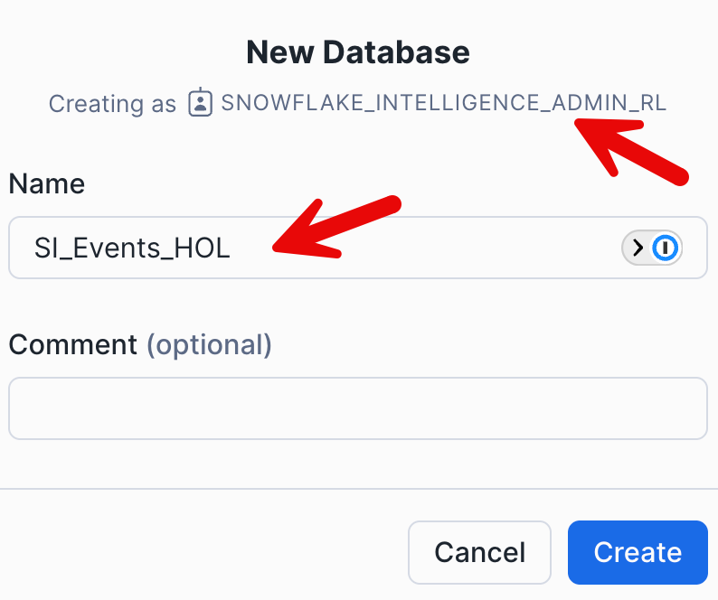
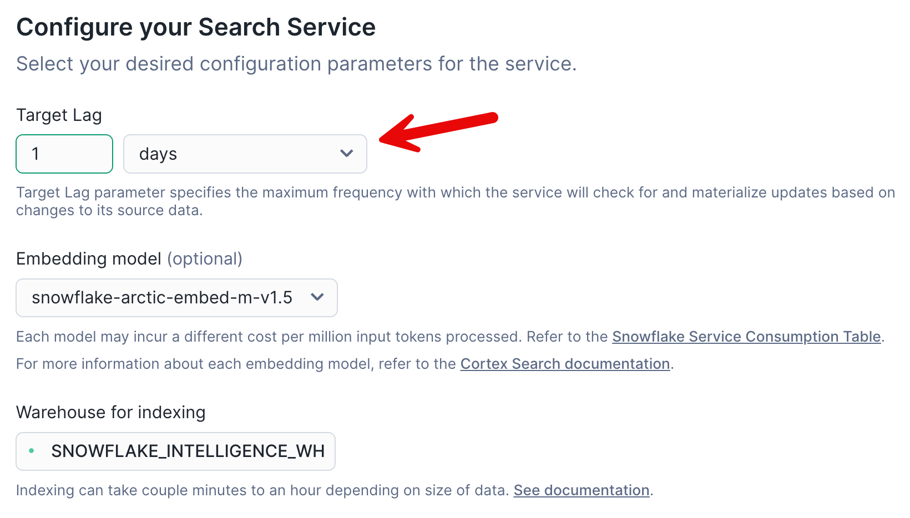

# Snowflake Intelligence HOL

## Step 1: Snowflake Intelligence Setup

You will need to enable these features on your demo account. Do this by logging into the deployment (snowflake.okta.com), choosing the correct deployment for your account, and then running this command. At this time (5/15/25), this is the case, but this process will change in the future.

```sql
alter account << account locator >>
set UI_ENABLE_AI_ML_FEATURE_19 = 'ENABLED'
, ENABLE_DATA_TO_ANSWER=true
, COPILOT_ORCHESTRATOR_PARAM_10='true'
, _DP_PEP_SI = true
, COPILOT_ORCHESTRATOR_PARAM_13='true'
, UI_ENABLE_AI_ML_FEATURE_29 = 'ENABLED'
, FEATURE_CORTEX_AGENT_ENTITY = 'ENABLED'
, CORTEX_REST_DATA_AGENT_API_ENABLE = true
, _DP_PEP_SI_ADMIN = true
, _DP_PEP_SI_ADMIN_CHAT = true
, _DP_PEP_SI_ENABLE_AGENT_OBJECTS = true
, parameter_comment = 'Enable Snowflake Intelligence SE Demo';
```

This will allow you to see the needed navigation in Snowsight.


### A few things to note:

  * If you go into Snowflake Intelligence at this point, it will say "No agents created."
  * At this time, Snowflake Intelligence (SI) will utilize your default role. You need to make sure this is set to the role we will create in the lab (directions below).
  * Snowflake Intelligence will also utilize your default warehouse; you must set this up for SI to work.


Users in Snowflake Intelligence will map to Snowflake users. Over time, we will move the UI out of Snowflake Snowsight and into a standalone experience (ai.Snowflake.com), but even there, Snowflake roles are planned to be leveraged for configuration. Users of Snowflake Intelligence need a few layers of permissions:

  * They need permission to the underlying Cortex Search Service and the ability to call Cortex Analyst.
  * They need permission for any underlying data surfaced by an agent.

-----

### Important notes:

  * Users for Snowflake Intelligence need to have a default role and a default warehouse.
  * The database needs to be named `Snowflake_intelligence`.

### Metadata Objects

Please create a new worksheet and run this script to create the database and schema needed to organize agents that surface in Snowflake Intelligence.

```sql
create database snowflake_intelligence;
create schema snowflake_intelligence.agents;

-- make sure anyone in the account can SEE agents
grant usage on schema snowflake_intelligence.agents to role public;

-- optional - you can grant other roles the ability to create agents
-- grant create agent on schema snowflake_intelligence.agents to role <some_role>;
```

-----

## Step 2: Load Festival Data

For our lab, we will use some made-up festival data. To support this, we will need to load multiple tables. Please go to the folder and get all the files listed there.

[Snowflake Intelligence Festival Data](https://www.google.com/search?q=/data)

Log into your Snowflake Demo Account and create a space for these tables to live through the UI. Let's create a database we will call it `SI_EVENTS_HOL`:




Let's create the tables we need for this lab. There are a total of 4 tables needed for this lab, and they can all be created the same way by creating a table from a file in Snowflake. Please repeat the following steps for all four tables:

1.  Customers
2.  Contracts
3.  Ticket Sales
4.  Events

We will load these tables into the public schema.

To load a table from a file in Snowsight, go into the `SI_Events` database we created, go to the Public schema, and go into tables, and then click the create button on the top right to create a table from a file:


Name each table the same name as the file you unzipped:


Open the View Options section in the file format area and make sure that the header is the first line of the document:


Repeat this for all 4 files so you have all 4 tables needed for the lab. When you are complete, you should see the following under tables in the public schema:


-----

## Step 3: Create a Simple Agent

What is an agent? Agentic AI is the buzzword of 2025, but with Snowflake agents, these are tangible things we're creating that will include one or more Cortex building blocks, like an analyst semantic model or search service.

Go to Snowflake, and the Agents section should now work with the config tables we created above. The page will keep attempting to redraw at this point, but that is expected for now. Go ahead and click on Create Agent.


Let's create a very simple agent. Let's name it **Claude**. Let's give it a Display name of **Claude** as well.


Refresh the screen, and we will see the new agent created:


-----

## Step 4: Go to Snowflake Intelligence

To easily navigate while using the Snowflake Intelligence application, open a new browser tab specifically for Snowsight. This will allow you to switch between the standard Snowsight interface and the Snowflake Intelligence application, which you can access via the Snowflake Intelligence link. After clicking the link, the navigation will change to focus on Snowflake Intelligence.


Now we can see our agent that we created in the dropdown and be able to interact with Snowflake intelligence easily:


I can also upload files as needed to have Claude look at the file and complete my analysis.

Go ahead and query Snowflake Intelligence. Let's ask this: What can you tell me about the company Snowflake?


We have currently developed a basic agent lacking access to data within your Snowflake account. It solely interacts with Claude. To enhance its intelligence, we need to integrate a semantic model and connect it to the agent, thereby providing improved context.

-----

## Step 5: Create a Semantic Model

Let's now build a more intelligent agent that analyzes the data within Snowflake by utilizing our semantic layer.

Lets create a semantic view using cortex analyst:


Go ahead and select create new view:


We can choose the SI\_EVENTS\_HOL database and PUBLIC schema we created earlier. Then we can select Semantic Views and enter the following name and description:

  * **Name:** `music_festival`
  * **Description:** `This has information on music festivals, including locations, events, and ticket sales`

Let's select our tables from the SI\_EVENTS\_HOL data that we imported at the beginning of the lab:


Then we can select the columns to choose. Let's just select all columns by choosing the top checkbox:


### View the Results

When we click 'Create and Save' it will generate a starter semantic model for us:


We can see that it has already created a description as well as some other details, like synonyms. Let's go ahead and add 'show' and 'concert' to the list of synonyms for EVENT\_NAME in the EVENTS table:


### Move Columns

The model incorrectly identified EVENT\_ID as a fact due to its numerical data type, but it is actually a dimensional column. This can be easily corrected by moving it to the dimensions section in the edit menu. It is crucial to review and adjust the model after Snowflake's initial column categorization.


We will need to do this for the following incorrectly identified columns:

1.  TICKET SALES
      * TICKET\_ID - move to dimension
      * EVENT\_ID - move to dimension
      * CUSTOMER\_ID - move to dimension
2.  CUSTOMERS
      * CUSTOMER\_ID - move to dimension
3.  EVENTS
      * EVENT\_ID - move to dimension

We also need to assign unique values option to primary keys. We will do this for the following tables:

1.  Ticket Sales
      * Ticket\_ID
2.  Customers
      * Customer\_ID
3.  Events
      * Event\_ID

This is done by editing each dimension and then checking the box for unique identifier:


Do this for all the listed tables above. Then you will need to save the semantic model and refresh the page.


### Test the Model

I can test this model right now by going to the side window and putting in the following prompt: `What are the different events in Europe`


Then it will go against my model and then write SQL, and then execute that SQL against my model.

### Define Table Relationships

We then need to define our relationships with the other tables. By default, no relationships are created, but they are needed for more complex queries that span multiple tables. When selecting the columns if you do not see your columns you might have missed the step to make ID columns unique on the table please see above. You might also just need to do a full refresh on the page.

Our first relationship we will define is TICKET\_SALES to EVENT. For every EVENT, there are many ticket sales, and the joining column is EVENT\_ID. Let's define a relationship that represents that:

  * **Relationship Name:** `TicketSales_to_Events`
  * **Left Table:** `Ticket_Sales`
  * **Right Table:** `Events`
  * **Relationship Columns:** `EVENT_ID` and `EVENT_ID`


Let's add a second relationship of customers to tickets:

  * **Relationship Name:** `TicketSales_to_Customers`
  * **Left Table:** `Customers`
  * **Right Table:** `Ticket_Sales`
  * **Relationship Columns:** `CUSTOMER_ID` and `CUSTOMER_ID`


Now we have two relationships set up in our semantic model. Let's go ahead and test them using the prompt on the right side. We can ask this: `How many ticket sales were there for Difficult Fest?`


We can see that it was able to utilize our join and see how many tickets were sold for that event by joining the two tables together we defined in our relationship.

We can also ask it to `Count the total customers by customer region that went to Difficult Fest`, and this should span all of our tables in our semantic model and give us values:


Excellent\! This functionality is operating as anticipated.

### Verify the Queries

Since these queries returned the correct values, we can add them as verified queries, which will fuel our model's improvement.


These will now show up under verified queries in our model definition:


### Save the Model

When you are done, make sure you save the model:


-----

## Step 6: Create an Agent to Use the Semantic Model

Let's go back to the agents now and create a new Agent.


We will use the following information:

  * **Name:** `Music_Festival_Agent`
  * **Description:** `An agent that can return information about music festival events and ticket sales`

After those are filled in, go ahead and click '+ Semantic Model', and attach the semantic model we created earlier.


Then go ahead and edit the agent by click on it.


Then go to edit:


Then choose tools and add the semantic model you created from earlier:

  * Choose to add a semantic view
  * Choose the database and schema where we created it (SI\_EVENTS\_HOL.PUBLIC)
  * Choose the Semantic View we created: MUSIC\_FESTIVAL
  * Choose the warehouse: Snowflake\_Intelligence\_WH
  * Choose the Query Timeout: 600
  * Write a description: This is our festival data that we have stored in snowflake in tables and structured data

Click Add the Semantic model


After adding be sure to click save in the agent editor.


-----

## Step 7: Test with Smart Agent

Let's go back to Snowflake Intelligence to see our new agent, which leverages our semantic model. Either click Snowflake Intelligence or go to your Snowflake Intelligence tab and refresh the page.

We can now see the Music Festival Agent.


Let's ask it a question: `Show me the top 5 events by tickets sold.`


Fantastic, it gave us an answer with a chart of the top 5 events\! I can open the SQL section and see the join in the SQL.


We can ask another question: `What is the ratio of ticket types purchased for Instead Fest?`


A third question I could ask is: `Did any one customer go to multiple shows?` This would utilize a synonym we created (show) as well as utilize the relationship we created to the customers table:


These answers appear to be correct. If they were incorrect, the first step would be to review the semantic model. This review would focus on verifying the accuracy of the defined relationships and identifying any potential synonyms that could enhance the model's intelligence and robustness.

-----

## Step 8: Create Search Service

We have document data that has been parsed and loaded into a table named Contracts from a Contracts.csv file. To enable searching of this text data, we will create a search service. This can be done by navigating to Al & ML, then Cortex Search, and following the wizard.


We can create it in our SNOWFLAKE\_INTELLIGENCE.CONFIG database and schema, and call it `Festival_Contract_Search`.


Going to the next screen, it asks for the table that it wants to index. We will select a table that we uploaded earlier. This is in the SI\_EVENTS\_HOL.PUBLIC and our table is called CONTRACTS.


The next screen asks us to choose which column we want to be able to search. In our case, the column name is TEXT. Go ahead and select that column from the list.


Next, it is asking what attributes we want to bring in. We will choose both DOCUMENT\_TITLE and URL:


We will leave all columns on the next page selected:


As this is a demonstration with unchanging data, the chosen lag time is inconsequential. Therefore, a 1-day lag can be applied.



Now our Search Service is created:


> **NOTE:** If your search service hangs in 'Initialize' for more than a few minutes, it might have failed. This is going to be fixed in the UI in the future. However, right now you can run: `DESC CORTEX SEARCH SERVICE FESTIVAL_CONTRACT_SEARCH;` and look at the indexing\_error column, chances are it is a missing permission on an object such as a database, schema, table, or warehouse.

-----

## Step 9: Add to Agent

We will reuse the previously created "Music Festival Agent" and integrate the Search Service we built into it. To do this, select the existing agent and then go to edit and proceed to add the Search Service.

Then choose Tools and add the Festival Contract Search Cortex search agent you created. Choose the URL and Document Title as shown below:


We will then add the search service by selecting where we created it, which was in SNOWFLAKE\_INTELLIGENCE.CONFIG we will call it Festival Contract Documents, and make sure we define the URL column in our search service, which is called URL:

The service needs to be active before it can function, which will take a few minutes. Completion is indicated when the Serving State shows as ACTIVE.

> **NOTE:** If your search service hangs in 'Initialize' for more than a few minutes, it might have failed. This is going to be fixed in the UI in the future. However, right now you can run: `DESC CORTEX SEARCH SERVICE FESTIVAL_CONTRACT_SEARCH;` and look at the indexing\_error column, chances are it is a missing permission on an object such as a database, schema, table, or warehouse.


Make sure to save the agent after updating it with the new cortex search service:


-----

## Step 10: Test with Updated Agent

Let's go back to Snowflake Intelligence and make sure our new search service is available to query.


Now that we see our Snowflake Data there, we know it will utilize our search service we created. Let's ask it a question: `What is the cancellation policy for the band Algorhythms?`


Notice that no SQL is generated or written, as it is using our search service. It gives us the answer and the source of the document from which this information came.

-----

## Step 11: Review

This lab explored Snowflake Intelligence and its applications. Snowflake Intelligence enables analysts to efficiently query Snowflake data by leveraging a semantic model or the Cortex search service for data indexing.

Our steps were:

1.  Setup metadata for Snowflake Intelligence (this part will go away in the future)
2.  Create a dumb agent that just used Claude with no Snowflake data
3.  Created a Semantic Model
4.  Created a new agent to utilize the new semantic model and Snowflake Data
5.  Created a cortex search service
6.  Updated our agent to utilize that search service
7.  Wrote prompts in Snowflake Intelligence that utilized our semantic model and/or our search service to get data from our Snowflake instance

Customers can now easily build a chatbot-like interface for analysts and search their Snowflake assets using simple wizards, requiring minimal coding. This eliminates the need for complex custom Python scripts (though that remains an option), enabling faster value realization with GenAI within Snowflake.

-----

## Step 12: Validate Using DORA

**Please only complete this if you are a snowflake employee and in the SE organization**

Congrats\! You have completed the lab. Please run the following commands in Snowsight to confirm your completion.

  - [Greeter Script for DORA](https://www.google.com/search?q=/config/SE_GREETER.sql)
  - [Grading Script for DORA](https://www.google.com/search?q=/config/DoraGrading.sql)

-----

## Step 13: Reset your default warehouse and Default Role

We recommend resetting your default role and warehouse to `ACCOUNTADMIN`. While not strictly necessary, this can help prevent issues in other labs.
